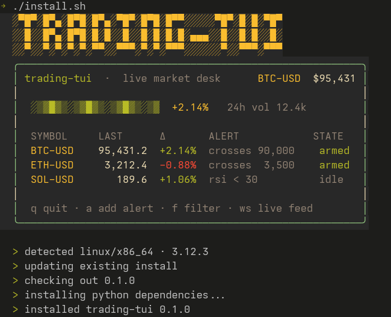

# trading-tui

[](https://www.python.org/downloads/)
[](LICENSE)
[](OSSMETADATA)
[](tests)
[](https://fastapi.tiangolo.com/)
[](https://textual.textualize.io/)
[](https://discord.com/invite/JEJCUJefMk)



A modular, reactive terminal UI application built with Textual and FastAPI that
provides real-time market monitoring, candlestick rendering, technical
indicators, and **price alerts** directly from your favorite CLI tool. Built
with async-first design patterns for zero-latency data streams.

## Features

- **Market data REST API**: candles and quotes via pluggable exchange
  adapters (`yahoo` default, no API key; `binance`). Yahoo also powers
  predefined screeners and a custom screener over the full US universe.
- **Price alerts**: one or more conditions (Above / Below / Crossing), AND/OR
  combination, once-only or every-time triggering, expiration, custom messages,
  and notification channels.
- **Alert evaluation**: `AlertService` reacts to price updates (observer-style
  `handle_price`) without coupling market data to alerts.
- **Notification channels**: extensible channel abstraction (`in_app` is
  implemented; `toast`/`sound`/`push`/`email` are registered no-op
  placeholders). A global delivery preference filters which channels may fire.
- **Textual TUI**: keyboard-first console opening on a **live market screener**:
  - Predefined Yahoo lists (`t` top most-active · `g` gainers · `l` losers).
  - **Multiple watchlists** (`w`; `tab` cycles, `n` creates).
  - **Custom screener** (`s`) over the full universe (~20k US stocks) with
    filters like `sector:technology mincap:1b sort:percentchange`.
  - Sortable (`1`-`5`), paginated (`[` / `]`, 25 rows), searchable (`/`) and
    change-filtered (`f`/`u`/`d`) table with price, 24h change %, latest OHLC
    and per-symbol alert state.
  - Alerts list (`a`, `p` back): create modal with inline validation,
    enable/disable/delete.
  - Settings modal (`o`): watchlist mode, lists, price-change sources,
    thresholds and delivery.
- **Background price monitor**: TUI worker polls quotes every 60s and fires a
  toast when a symbol crosses an enabled % change threshold (re-arms only after
  falling back below it).
- **Currency formatting**: 16 currencies (`CURRENCY` env, default `usd`) with
  locale-aware symbols/separators across all price columns.
- **SQLite persistence**: alerts survive restarts (`SqliteAlertRepository` via
  `aiosqlite`, WAL mode; path from `ALERTS_DB_PATH`, default project root
  `alerts.db`).
- **User settings**: watchlists + notification prefs persisted atomically to
  `~/.config/trading-tui/settings.json` (override with `TRADING_TUI_SETTINGS`).
- **Packaging & deploy**: `trading-tui` / `trading-tui-api` console scripts,
  `install.sh` one-liner installer, Dockerfile + `docker-compose.yml`.

## Quick start

```bash
# Install (editable, with dev deps)
uv pip install -e ".[dev]"

# Create .env (required at import time)
cat > .env <<'EOF'
ADAPTER_NAME=yahoo
DEFAULT_SYMBOL=BTC-USD
EOF

# Run API server (alerts persist to project-root alerts.db: override with ALERTS_DB_PATH)
uvicorn app.main:app --reload --port 8333

# Run the TUI (alerts console)
uv run python -m tui_client.app
```

OpenAPI docs: http://127.0.0.1:8333/docs

User settings live in `~/.config/trading-tui/settings.json` (press `o` in the
TUI to edit them); override the path with `TRADING_TUI_SETTINGS`. Alerts are
stored in SQLite (`alerts.db`).

## Install as a CLI tool (btop-style)

Two console scripts are packaged: `trading-tui` (the TUI) and
`trading-tui-api` (the FastAPI server).

```bash
# Option A: isolated tool install (recommended for a daily-driver CLI)
uv tool install .

# Option B: into your current venv
uv pip install -e .
```

Then, from any directory that contains a `.env` (settings are read from the
current working directory):

```bash
trading-tui              # one command: spawns the API if needed + opens the console
```

The TUI talks to `http://127.0.0.1:8333` by default. If the server isn't
running, `trading-tui` starts it in the background and kills it on exit. Run
`trading-tui-api` separately when you want the server to stay up (Docker/VPS
setup, or multiple TUI sessions).

Keys: `t` top · `g` gainers · `l` losers · `w` watchlist · `s` custom
screener · `a` alerts · `p` back to prices · `n` new alert / new watchlist ·
`r` refresh · `e`/`d`/`x` enable/disable/delete · `o` settings · `q` quit.
Prices table: sort with `1`-`5` (symbol/price/chg %/volume/cap; press again to
flip direction), filter with `f`/`u`/`d` (all/up/down), search with `/`, page
with `[`/`]` (25 rows per page), cycle the top-level lists with `tab`
(in watchlist mode with multiple lists, cycle your watchlists with
`ctrl+right`). Columns:
Symbol / Name / Price / Chg % / OHLC / Volume / Cap / Alert.

Screeners come from Yahoo's predefined lists (`most_actives`/`day_gainers`/
`day_losers`, 250 quotes); the custom screener (`s`) queries the full Yahoo
universe via `GET /market/screener` (filters: `region`, `sector`, `mincap`,
`maxcap`; sorts: `marketcap`/`percentchange`/`price`; paginated `size`/
`offset`) and uses Yahoo's cookie+crumb auth automatically. Watchlists live in
`~/.config/trading-tui/settings.json` (seeded from `DEFAULT_WATCHLIST` in
`tui_client/screens/prices.py`). Change % comes from Yahoo's
`regularMarketChangePercent` (24h); OHLC is the latest daily candle.

## REST API

### Market data (`/market`)

| Method | Path | Description |
|--------|------|-------------|
| GET | `/market/candles?symbol=BTCUSDT&interval=1h&limit=500` | OHLCV candles |
| GET | `/market/quotes?symbols=BTCUSDT,ETHUSDT` | Latest prices |
| GET | `/market/screeners?scr_id=most_actives&count=250` | Predefined Yahoo screeners (`most_actives`/`gainers`/`losers`) |
| GET | `/market/screener?region=us&sector=technology&mincap=1e9&sort=percentchange&size=50&offset=0` | Custom screener over the full universe |

### Alerts (`/alerts`)

| Method | Path | Description |
|--------|------|-------------|
| GET | `/alerts` | List alerts (expired ones auto-flagged) |
| POST | `/alerts` | Create an alert (201) |
| GET | `/alerts/{alert_id}` | Get one alert |
| DELETE | `/alerts/{alert_id}` | Delete an alert (204) |
| POST | `/alerts/{alert_id}/enable` | Re-activate a disabled alert |
| POST | `/alerts/{alert_id}/disable` | Disable an alert |
| POST | `/alerts/evaluate` | Feed a price update `{symbol, price}`; returns fired events |

Create example:

```json
{
  "symbol": "ETHUSDT",
  "conditions": [
    {"metric": "price", "operator": "crossing", "value": 3794.94},
    {"metric": "price", "operator": "above", "value": 4000.0}
  ],
  "match_mode": "ALL",
  "trigger_mode": "ONCE",
  "expires_at": "2026-10-06T15:13:00Z",
  "message": "ETHUSDT crossing 3794.94",
  "notification_channels": ["in_app", "toast"]
}
```

- **Operators:** `above`, `below`, `crossing` (crossing detects a transition
  through the target using the previous price: equality alone is not a cross).
- **match_mode:** `ALL` (AND) or `ANY` (OR).
- **trigger_mode:** `ONCE` (fires once → `TRIGGERED`) or `EVERY_TIME`.
- **expires_at:** required to be timezone-aware and in the future; expired
  alerts are never evaluated.
- **Status lifecycle:** `ACTIVE → TRIGGERED | EXPIRED | DISABLED`.
- Errors: `404 AlertNotFound`, `422 InvalidAlertConfiguration` (validation),
  `409 AlertExpired`. No stack traces leak to clients.

## Architecture

```
Market price update
        │
        ▼
AlertService.handle_price(symbol, price)   ← Observer entry point
        │
        ├─ Condition strategies (Strategy): above / below / crossing
        │    └─ build_condition(spec)       ← Factory
        ├─ AlertRepository (Repository): SqliteAlertRepository (aiosqlite, WAL)
        └─ NotificationService: fans AlertEvent out to channels
             └─ NotificationChannel (Adapter/Strategy): in_app/toast/sound
```

- Domain model (`app/services/alerts/domain.py`) is storage- and UI-agnostic.
- DTOs live in `app/models/alert.py`; UI view model in `tui_client/api.py`.
- Services are injected into FastAPI via `app.state.alert_service`
  (dependency injection / composition root in `app/main.py`).
- `tui_client/` talks to the REST API through `AlertApiClient`
  (`HttpAlertApi` by default): the TUI never evaluates conditions.
- The TUI also runs a `PriceChangeMonitor` worker (60s quote poll →
  threshold toast) and persists user settings to JSON
  (`tui_client/settings.py`). The API reads only the delivery preference from
  that file (`app/services/user_prefs.py`) to filter notification channels.

## Tests

```bash
pytest
```

Covers condition edge cases (including crossing transitions), alert lifecycle
(ACTIVE→TRIGGERED/EXPIRED, DISABLED skip, once-only), ALL/ANY combination,
notification emission (mocked channels), the full REST surface (CRUD,
validation errors, status codes), and TUI flows via Textual's pilot (open
modal, add condition, create, validation, cancel: no sleeps).

Test modules: `test_conditions`, `test_alert_service`, `test_repository`,
`test_sqlite_repository`, `test_api_alerts`, `test_api_market`,
`test_notifications_delivery`, `test_settings`, `test_tui`.

## Versioning

This project follows [Semantic Versioning v2.0.0](https://semver.org/spec/v2.0.0.html).
Public APIs are not broken without a major version bump: breaking changes to
the HTTP endpoints, the CLI/console scripts, or the persisted alert/settings
formats require a `MAJOR` release. See [RELEASES.md](RELEASES.md) for the
release history and full policy.

## Project status

### Done

- [x] Async FastAPI backend with adapter registry + DI composition root.
- [x] Adapters: `yahoo` (candles, quotes, predefined screeners, custom
  screener with cookie+crumb auth) and `binance` (candles, quotes).
- [x] Market REST: `/market/candles`, `/market/quotes`, `/market/screeners`,
  `/market/screener`.
- [x] Alert domain, condition strategies (above/below/crossing), ALL/ANY and
  once/every-time modes, expiration, status lifecycle.
- [x] Alerts REST CRUD + `/alerts/evaluate`; structured errors, no stack leaks.
- [x] SQLite persistence (`aiosqlite`, WAL) with in-memory repo for tests.
- [x] Notification channel abstraction + `in_app`; global delivery filter.
- [x] Textual TUI: prices/watchlist/screener table, sort/filter/search/page,
  multi-watchlist, alert list + create modal, settings modal.
- [x] Background threshold monitor (60s poll → toast, re-arming).
- [x] Currency formatting (16 currencies); persisted user settings JSON.
- [x] Console scripts, `install.sh`, Dockerfile, `docker-compose.yml`,
  `.env.example`.
- [x] Test suite: conditions, service, repositories, REST, notifications,
  settings, TUI pilot.

### To cover (roadmap)

- [ ] **Live WebSocket feed**: `WSMsg` schema exists but no endpoint is
  mounted; prices are polled over REST today. Add `/market/ws` for
  candles/quotes push.
- [ ] **Real notification channels**: `toast`/`sound`/`push`/`email` are no-op
  placeholders; add Email, Webhook, Discord, Telegram adapters.
- [ ] **Portfolio**: settings expose a "portfolio" source, but the monitor
  returns nothing for it (no holdings feature yet).
- [ ] **Charts & indicators**: `plotly` is a dependency but candlestick
  rendering / technical indicators are not implemented; the TUI shows OHLC only.
- [ ] **Binance screeners**: `fetch_screeners` / `fetch_screener_search` raise
  `NotImplementedError` (HTTP 400).
- [ ] **Auto alert evaluation**: alerts fire only via `POST /alerts/evaluate`;
  wire the price monitor / market stream into `AlertService.handle_price`.
- [ ] **In-app notification log**: `InAppChannel` keeps events in memory but
  the TUI does not surface them yet.
- [ ] **Adapter lifecycle**: adapters are built per request (no shared HTTP
  client); move to a managed lifespan.
- [ ] **Project tooling**: no linter/formatter/typechecker, CI, or release
  automation yet; add `CONTRIBUTING.md`, `CODE_OF_CONDUCT.md`, `RELEASES.md`.